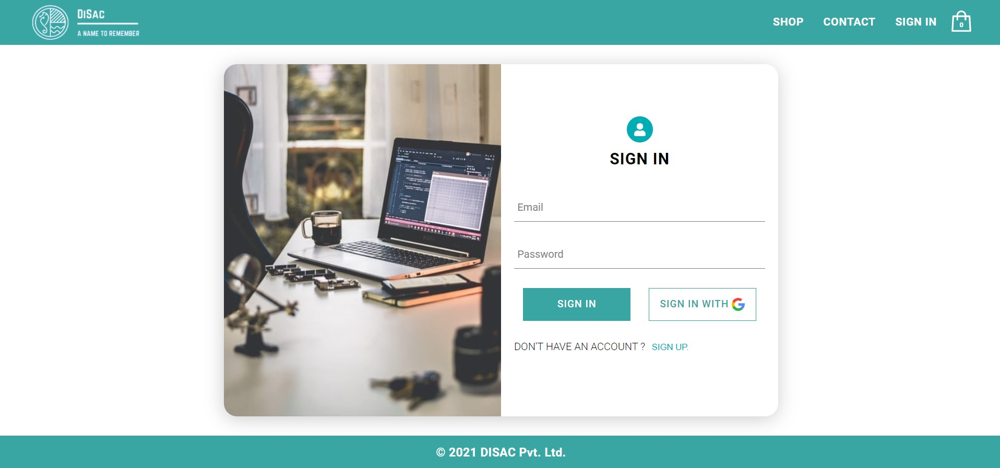

# DISAC - Full-Stack E-Commerce Website

  


This is a full-stack e-commerce website developed using React.js, Redux, Material-UI, Firebase for authentication and database, Stripe for payment processing, and Styled Components for styling. The website allows users to browse products, add items to their cart, make purchases, and manage their accounts.


## Prerequisites

Before you begin, ensure you have met the following requirements:

- Node.js and npm installed
- Firebase account for authentication and database
- Stripe account for payment processing


## Installation

1. Clone the repository:
```bash
git clone https://github.com/ScaryWings83289/DISAC.git
cd DISAC
```

2. Install dependencies:
```bash
yarn install
```

3. Configure environment variables (e.g., Firebase and Stripe credentials) in a .env file.

4. Start the development server:
```bash
yarn start
```

5. Access the website by navigating to http://localhost:3000 in your web browser.


## Usage 

The website allows users to:

- Browse a catalog of products with detailed descriptions.
- Add products to the shopping cart.
- Adjust the quantity or remove items from the cart.
- Proceed to checkout and make payments securely using Stripe.
- Create accounts, log in, and manage their profiles.
- View order history and track order status.


## Features
Here are some key features of the website:

- User registration and authentication using Firebase.
- Real-time product updates and cart management.
- Secure payment processing through Stripe.
- Dynamic and responsive design with Material-UI and Styled Components.
- User-friendly interfaces for adding and viewing a particular product.

**SCREENSHOTS:**

Landing Page:


Product Preview:


Sign-in && Sign-Up Page:



Cart Section:


## Developed With

* [Visual Studio Code](https://code.visualstudio.com/) - A source code editor developed by Microsoft for Windows, Linux and macOS. It includes support for debugging, embedded Git control, syntax highlighting, intelligent code completion, snippets, and code refactoring
* [React](https://reactjs.org/) - A javascript library for building user interfaces
* [Create react app](https://create-react-app.dev/) - A quick method to start developing a react application.
* [Firebase](https://firebase.google.com/) - Firebase is a set of backend cloud computing services and application development platforms provided by Google.
* [Babel](https://babeljs.io/) - A transpiler for javascript
* [Webpack](https://webpack.js.org/) - A module bundler
* [SCSS](http://sass-lang.com/) - A css metalanguage

